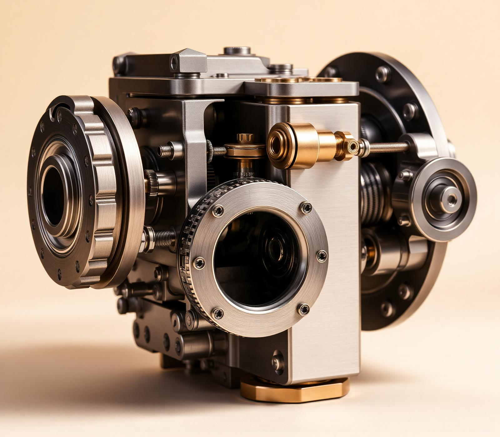
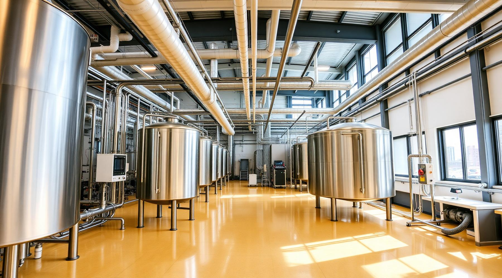

# AARRKKAA International — Official Digital Portal (Phase 1)



**AARRKKAA International** is a premier global supplier and distributor of high-performance industrial equipment, specializing in precision mechanical seals, industrial process pumps, hygienic food-grade systems, elastomers, valves, and stainless steel fittings.

This repository hosts the state-of-the-art web application and digital engineering catalog for AARRKKAA International, engineered from the ground up for extreme speed, luxury industrial aesthetics, and intelligent customer engagement.

---

## 🚀 Live Enterprise Portal
**🌐 [aarrkkaa-seals.vercel.app](https://aarrkkaa-seals.vercel.app)**  
*(Service available globally · Powered by Vercel Edge & Nitro)*

---

## 🏁 Phase 1 Accomplishments & Key Innovations

In **Phase 1**, we transformed a standard industrial portal into a cutting-edge, highly interactive, and intelligent engineering platform. Below is a detailed breakdown of all systems, UI innovations, and features delivered:

### 1. 🎨 "Paper & Brass" Luxury Industrial Design System
* **Curated Palette:** Moved away from harsh, isolated black boxes and generic templates. Built a sophisticated aesthetic utilizing a warm **Paper** background (`#FAF9F5`), deep charcoal **Ink** (`#1C1B18`), and vibrant **Golden Brass** (`#D97706`) accents.
* **Harmonious Visuals:** Refined component backgrounds and borders across all pages so that interactive elements blend smoothly and guide user attention without visual fatigue.
* **Swiss/Apple Minimalist Typography:** Combined `@fontsource-variable/inter` with clean monospace CAD styling for technical metadata, specifications, and navigation badges.
* **Global Enterprise Tone:** Updated branding across all touchpoints from regional positioning to a world-class global footprint (*"Service available globally"*).

---

### 2. 🤖 AI Equipment Advisor & Intelligent Chatbot Ecosystem
* **Non-Intrusive Floating Assistant:** Engineered an interactive AI Chatbot docked in the bottom-left corner of the viewport (counterbalancing traditional right-side chat widgets).
* **100% Accurate Engineering Domain:** System-prompted and structured to answer complex technical queries regarding seal metallurgical grades, slurry pump tolerances, and hygienic dairy certifications.
* **Instant Omnichannel Routing:** Automatically recognizes when a customer needs human engineering support and provides instant, clickable telephone links, direct WhatsApp quotation triggers, and aligned email contact actions.
* **Reactive Global State Management:** Powered by a custom React `useSyncExternalStore` architecture (`chatbotState.ts`). When the AI Chatbot opens, page sidebars and peripheral navigation elements dynamically fade out to eliminate visual clutter, restoring smoothly upon exit.

---

### 3. ✨ High-Precision Interactive UI Components
Inspired by modern UI design patterns (such as React Bits) and tailored specifically for industrial engineering:
* **Border Glow Cards (`GlowCard`):** Implemented dynamic cursor-tracking golden brass border luminescence across key interactive sections:
  * **Why AARRKKAA:** 4 core value proposition cards.
  * **Client Testimonials:** Industrial reviews and reliability ratings.
  * **Find Us (Bento Grid):** 3 architectural location and contact cards.
* **Minimalist Line Sidebar (`LineSidebar`):**
  * An ultra-elegant, Swiss-style scroll-spy navigation track floating along the right viewport edge.
  * Features a whisper-thin `1px` background hairline with delicate `1.5px` ticks. As you scroll through page sections, the active indicator illuminates as a clean `2px` golden brass bar paired with a smoothly gliding typography label.
* **Interactive Lanyard Brand Display (`Lanyard`):**
  * A physics-inspired interactive badge display integrated into the Contact page, occupying empty space with a dynamic presentation of the AARRKKAA INTERNATIONAL logo and brand identity.

---

### 4. ⚡ 12-Category & 100+ SKU Digital Product Catalog
* **Complete Technical Coverage:** Engineered dynamic SSR routes (`/products/$category` and `/products/$category/$item`) showcasing:
  * **Mechanical Seals:** Cartridge, bellows, rotary union, and heavy-duty agitator seals.
  * **Process Pumps:** Centrifugal, monoblock, slurry, dosing, gear, vacuum, submersible, and hygienic milk pumps.
  * **Valves & Stainless Steel Fittings:** Ball, butterfly, gate, and check valves alongside industrial pipework.
  * **Precision Bearings:** Heavy-duty ball and roller bearing assemblies.
* **Verified Industrial Photography:** Integrated 20+ verified, premium Unsplash imagery assets capturing metallic textures, clean machined surfaces, and precision tolerances.
* **Seamless Quotation Flow:** Transformed isolated product call-to-actions ("Need this product on your line?") into intelligent routing links that direct customers to the quotation desk with their exact product SKU pre-populated!

---

### 5. 🛠️ Creative "Blueprint CAD" 404 Page & AI Remediation Protocol
* **Precision Blueprint Aesthetic:** Replaced standard error pages with `CreativeNotFound.tsx`, designed like a high-tech mechanical CAD drawing featuring grid lines and an animated 3D precision wrench (`4 [🔧] 4`).
* **One-Click AI Problem Solving:** Features a primary call-to-action: **`⚡ Ask AI Advisor How To Solve This 404`**.
* **Automated Remediation Protocol:** Clicking the button automatically opens the AI Chatbot in the bottom left and triggers a diagnostic workflow where the AI:
  1. Searches the master index across all 12 categories.
  2. Offers to cross-reference OEM part numbers and metallurgical grades from user drawings.
  3. Connects the user directly with custom fabrication engineers for obsolete or specialized seal replacements.

---

## 🛠️ Technology Stack & Architecture

This platform is built on a high-performance, edge-ready architecture ensuring lightning-fast Server-Side Rendering (SSR), optimal SEO indexing, and type-safe routing.

* **Framework:** [TanStack Start](https://tanstack.com/start/latest) (Full-stack SSR framework)
* **UI Library:** [React 19](https://react.dev/)
* **Styling & Design System:** [Tailwind CSS v4](https://tailwindcss.com/) + Vanilla CSS design tokens
* **Animation Engine:** [Framer Motion](https://www.framer.com/motion/)
* **Type-Safe Routing:** [TanStack Router](https://tanstack.com/router/latest)
* **Server & Deployment Engine:** [Nitro](https://nitro.unjs.io/) configured for Vercel Edge Functions
* **Icons:** [Lucide React](https://lucide.dev/)

---

## 📦 Local Development & Setup

To run or contribute to this repository locally:

### 1. Prerequisites
Ensure you have [Bun](https://bun.sh/) (recommended) or [Node.js](https://nodejs.org/) installed.

### 2. Clone Repository
```bash
git clone https://github.com/Nivas001/Seals.git
cd Seals
```

### 3. Install Dependencies
```bash
bun install
# or npm install
```

### 4. Start Development Server
```bash
bun run dev
# or npm run dev
```
Open your browser and navigate to `http://localhost:3000`. The server supports hot-module replacement (HMR) and instant SSR reloads.

---

## 🏗️ Production Build & Verification

To verify the build or generate production static/SSR bundles:
```bash
bun run build
# or npm run build
```
The production bundle is compiled via Nitro into `.vercel/output`, ready for instant zero-config deployment on Vercel.

---

## 📸 Architectural Preview


*Precision industrial components engineered for continuous operation.*

---
**AARRKKAA INTERNATIONAL** · *Excellence in Motion · Service Available Globally*  
*Phase 1 Complete · Deployed on Vercel*
