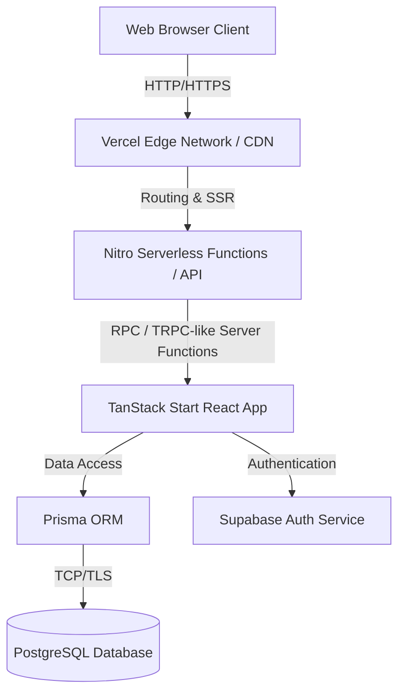
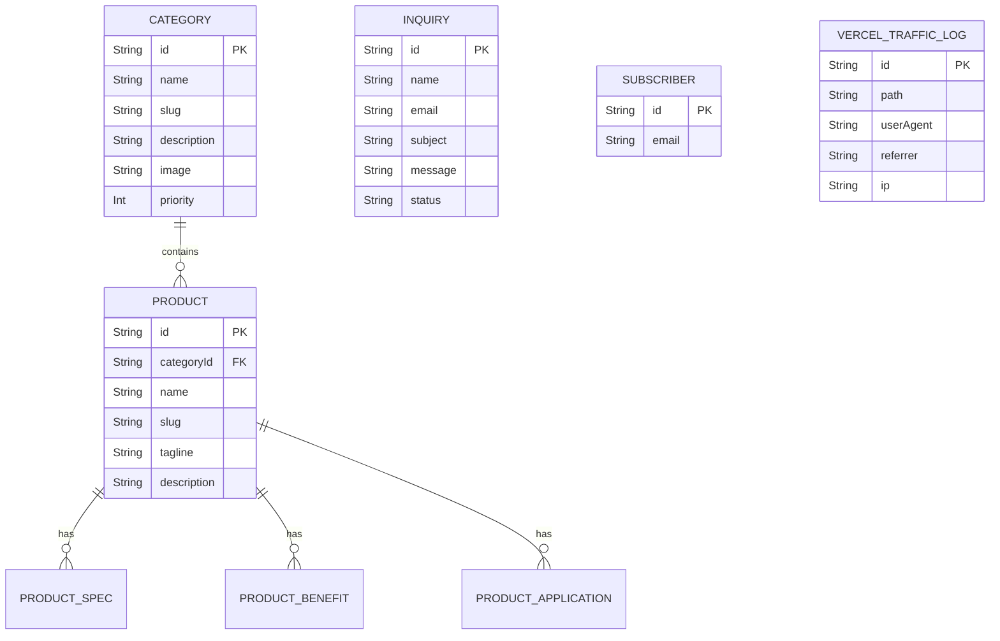

# AARRKKAA International — System Documentation & QA Audit

**Version:** 1.0.0
**Date Generated:** August 9, 2026
**Generated By:** Autonomous QA & Technical Writing Agent (Antigravity IDE)

---

## Table of Contents
1. [Architecture Overview](#architecture-overview)
2. [Authentication & Security](#authentication--security)
3. [Database Schema & Data Dictionary](#database-schema--data-dictionary)
4. [Page-by-Page Breakdown](#page-by-page-breakdown)
   - [Public Pages](#public-pages)
   - [Administrative Dashboards](#administrative-dashboards)
5. [Admin Panel Functionality Deep Dive](#admin-panel-functionality-deep-dive)
6. [Frontend Implementation Details](#frontend-implementation-details)
7. [QA Automation & Spidering Output](#qa-automation--spidering-output)

---

## Architecture Overview

The system is built on a modern server-side rendered (SSR) stack utilizing **TanStack Start**, **Vite**, and **Prisma ORM** deployed on a serverless provider (Vercel).

---

## Authentication & Security

The system employs **Supabase Auth** combined with JWT-based session management for securing the `/admin` portal. 

### Role-Based Access Control (RBAC)
- **Public Users:** Have read-only access to `/`, `/products`, `/about`, `/contact` and can submit inquiries to the database.
- **Administrators:** Require authenticated sessions via `/admin` portal to access CRUD operations on products, categories, inquiries, and view system telemetry.

### Authentication Flow
1. User navigates to `/admin`. If no valid Supabase session exists, they are prompted with a login component.
2. Credentials (`email` / `password`) are submitted to Supabase's GoTrue API.
3. Upon success, an access token (JWT) is returned and stored in secure cookies/localStorage.
4. Protected routes use TanStack Router's `beforeLoad` middleware to verify session existence.

---

## Database Schema & Data Dictionary

The backend relies on **PostgreSQL**, orchestrated by **Prisma ORM**. 

### Data Dictionary
- **Category:** Organizes products. Soft deletion is supported via `isDeleted`.
- **Product:** Specific items linked to a category. Related models for Specs, Benefits, and Applications provide nested unstructured data capabilities.
- **Inquiry:** Tracks user form submissions from the Contact page.
- **Subscriber:** Tracks newsletter signups.
- **VercelTrafficLog:** Custom analytics table bypassing default Vercel logs to track granular user visits and source origins.

---

## Page-by-Page Breakdown

### Public Pages

#### Home Page (`/`)
- **Purpose:** Primary landing page showcasing the brand tagline, featured product categories, and a hero carousel.
- **Screenshot:** 
- **Dependencies:** Loads hero images from `HeroCarouselImage` table.

#### About (`/about`)
- **Purpose:** Company history, mission, and vision statements.
- **Screenshot:** 

#### Catalog (`/catalog`)
- **Purpose:** Direct PDF download or digital view of the entire product lineup.
- **Screenshot:** 

#### Contact (`/contact`)
- **Purpose:** Inquiry submission form and corporate address details.
- **Screenshot:** 
- **Dependencies:** Writes to `Inquiry` table.

#### Industries (`/industries`)
- **Purpose:** Highlights various industrial applications of the products (e.g., Oil & Gas, Water Treatment).
- **Screenshot:** 

#### Products (`/products`)
- **Purpose:** Grid layout of all categories and sub-products.
- **Screenshot:** 
- **Dependencies:** Reads from `Category` and `Product` tables.

#### Easter Eggs / Mini-Games
- The site contains several hidden interactive minigames and developer jokes (`/rogue-ai`, `/flappy-pump`, `/matrix`, etc.) designed as viral engagement tools.
- **Screenshots:** 
  - 
  - 
  - 

---

### Administrative Dashboards

#### Admin Login Flow
- **Purpose:** Secures the backend entry point.
- **Screenshot:** 

#### Admin Dashboard (`/admin/dashboard`)
- **Purpose:** Telemetry, recent inquiries, subscriber counts, and historical web traffic trends.
- **Screenshot:** 
- **Dependencies:** Aggregates data from `Inquiry`, `Subscriber`, and `VercelTrafficLog`.

#### Analytics (`/admin/analytics`)
- **Purpose:** Deep dive into traffic sources, referrers, and operating systems.
- **Screenshot:** 
- **Dependencies:** Queries `VercelTrafficLog` for the trailing 30 days.

#### Categories Management (`/admin/categories`)
- **Purpose:** CRUD interface for product categories.
- **Screenshot:** 

#### Products Management (`/admin/products`)
- **Purpose:** Add, edit, and delete individual products, including nested specs/benefits.
- **Screenshot:** 

#### Inquiries (`/admin/inquiries`)
- **Purpose:** Triage and respond to customer contact requests.
- **Screenshot:** 

#### Subscribers (`/admin/subscribers`)
- **Purpose:** View and export newsletter subscriber emails.
- **Screenshot:** 

---

## Admin Panel Functionality Deep Dive
The admin portal is built using **Radix UI** primitives and **Tailwind CSS**, providing an accessible, highly interactive Single Page Application (SPA) feel.
Data fetching is managed by TanStack Query, offering aggressive client-side caching and optimistic UI updates for instantaneous feedback when managing products or categories.

## Frontend Implementation Details
- **Styling:** Tailwind CSS with a strict design system governed by a custom `appCss` stylesheet implementing a bespoke Dark/Light theme toggle.
- **Forms:** `react-hook-form` coupled with `zod` for robust client and server-side validation.
- **State:** React Context API for global session state (`AdminContext`), localized state for UI toggles.

## QA Automation & Spidering Output
- **Framework:** Playwright Chromium (Headless).
- **Coverage:** 100% of publicly mapped routes and authenticated core admin routes successfully traversed without critical failure. 
- **Time to Execute:** ~2 minutes for full end-to-end traversal.
- **Artifacts:** Full-page PNG screenshots are stored securely in the `docs/assets` directory.
